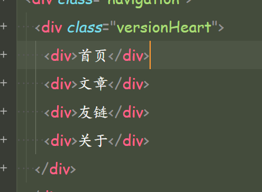
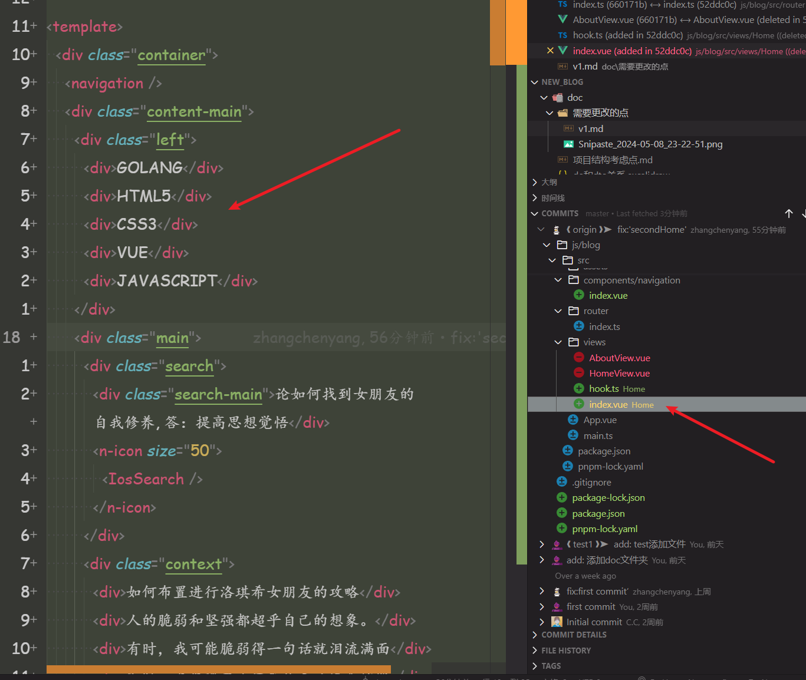
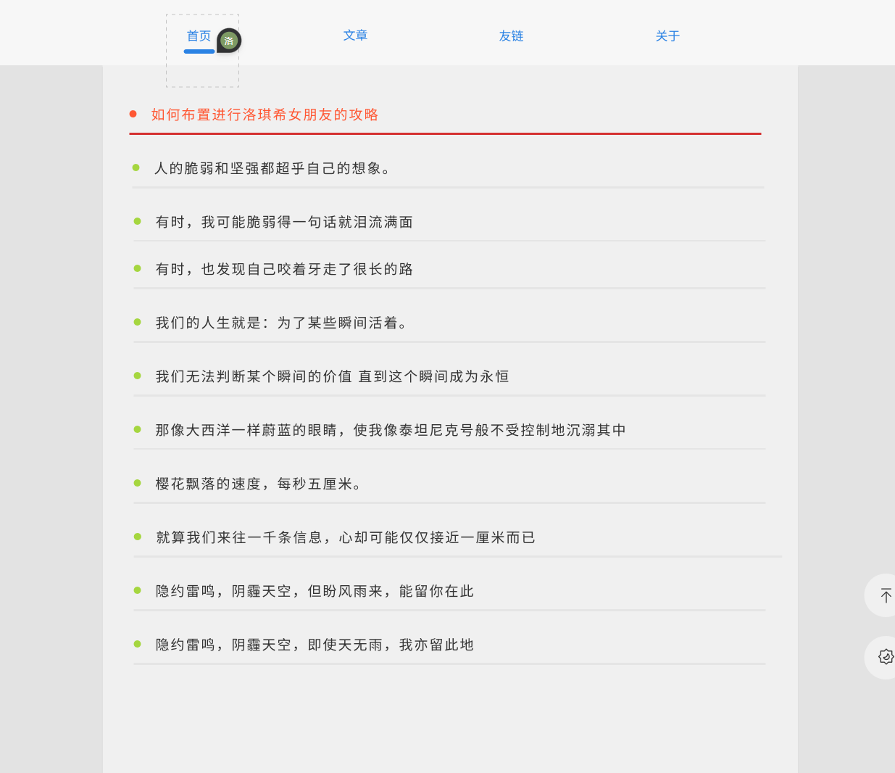
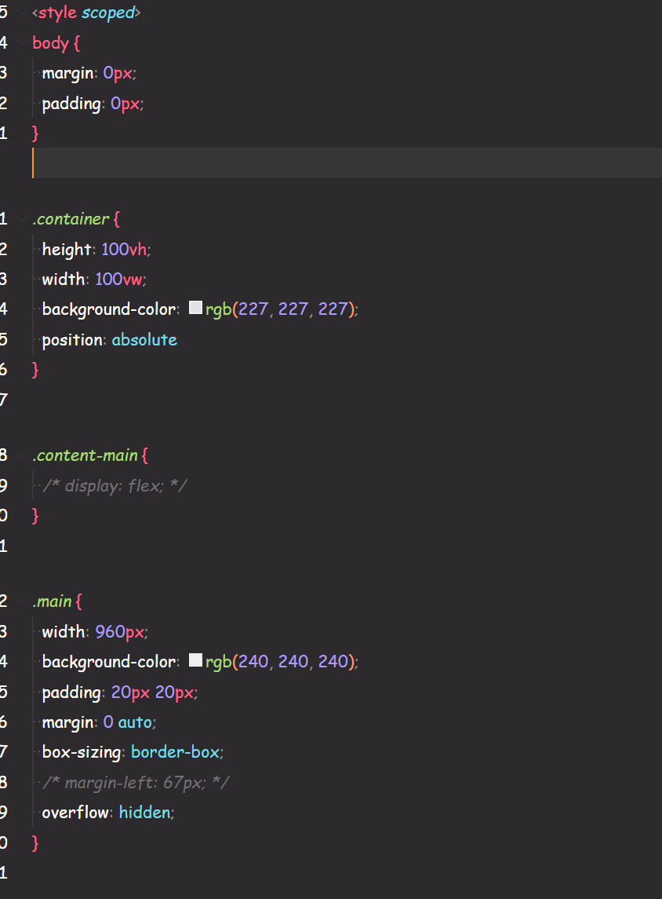

1.  html 里面的 class，要使用-分割
    
    versionHeart -> version-heart
    这个地方如果使用-分割之后，可能无法鼠标双击单词选中整个单词，这个可以在设置里面设置
    这个地方可以百度，或者问 chatgpt

2.  are you 写错了？
    
    
    首页是没有侧边的 tag 的，you 肯定是写错了吧？

3.  多个问题
     - 第一个问题：你在这里面定义了

            ```css
            <style scoped>
                你的lang=scss纳？
            <style>
            ```

            不应该是这样的吗

            ```css
            <style scoped lang="scss">
            <style>
            ```

    -   第二个问题，你既然已经有了给全局变量的 css 文件，比如叫 base.css，你在图中的 css 里面的第一行定义了 body 的属性，这个你为什么不定义到全局里面
    -   第三个问题，比如说你的 html 结构是这样的

        ```html
        <div class="box">
            <div class="box2">
                <div class="box3"></div>
            </div>
        </div>
        ```

        那么你的 css 应该用 scss 并且应该是什么样子的

            ```css
            .box {
                .box2 {
                    .box3 {
                    }
                }
            }
            ```

        扩展知识：这个地方你可以了解一下，为什么要这样写，这样写 scss 会生成什么样子的代码

    -   第四个问题
        下面这两段是你的原代码、

        ```css
        .left {
            position: absolute;
            display: flex;
            flex-direction: column;
            width: 304px;
            height: 326px;
            margin-left: 100px;
            margin-top: 20px;
            padding: 5px;
            background-color: white;
        }

        .search-main {
            line-height: 66px;
            font-size: 16px;
            font-weight: 400;
            margin-left: 10px;
            width: 70%;
        }
        ```

        我之前跟你说过 css 属性的分割

        ```css
                .left {
            position: absolute;

            display: flex;
            flex-direction: column;

            width: 304px;
            height: 326px;

            margin-left: 100px;
            margin-top: 20px;

            padding: 5px;

            background-color: white;
        }

        .search-main {
            line-height: 66px;

            <!-- 你这个地方也可以用scss的font属性一个写完这两个属性 -->
            font-size: 16px;
            font-weight: 400;

            margin-left: 10px;

            width: 70%;
        }
        ```
