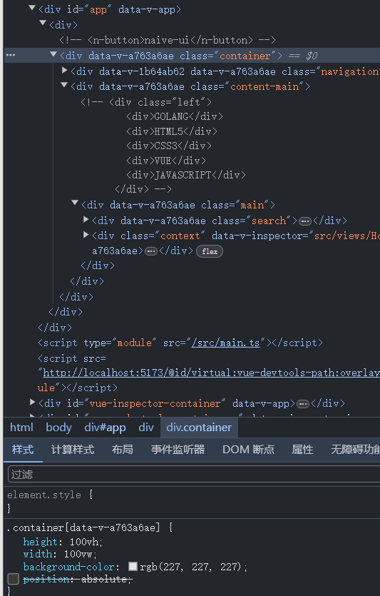
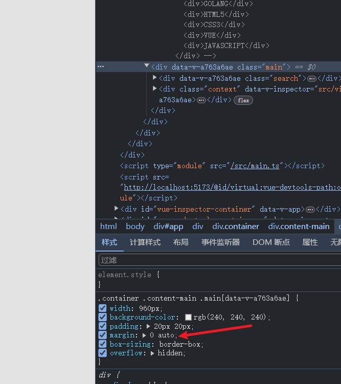

1. 请规范好你的 vscode 代码快捷生成方式
   你现在的 vue 文件不是 script 缺失 lang 属性就是 css 缺失
   完整的应该是:

```vue
<script setup lang="ts"></script>
```

请百度如何配置 vscode 用户代码判断

2. 关于路径"@"别名的配置,除了需要在 vite.config 里面配置还需要在 tsconfig 里面配置

3. 我新建了 goloals.d.ts 文件,你需要了解这个文件是干什么用的

4. 
   为什么 container class 属性里面要加绝对定位?
   你是否了解绝对定位的作用

5.
这个居中你是百度的?
那你百度过来是否知道为什么加 margin:0 auto 可以居中?
这个地方不是不可以用,但是你得知道为什么加他可以居中
那加 flex 为什么可以居中,他的主轴是什么?这些你都要知道
