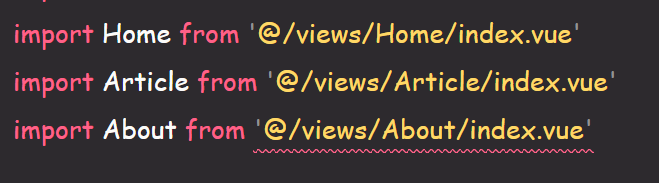
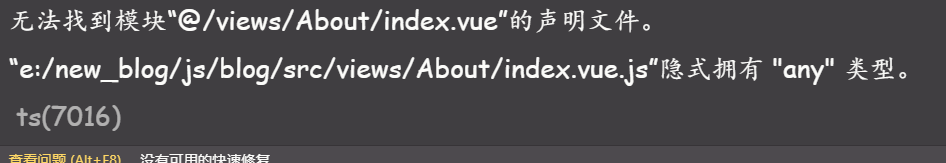
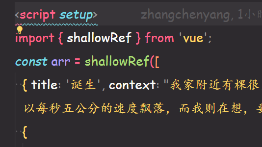
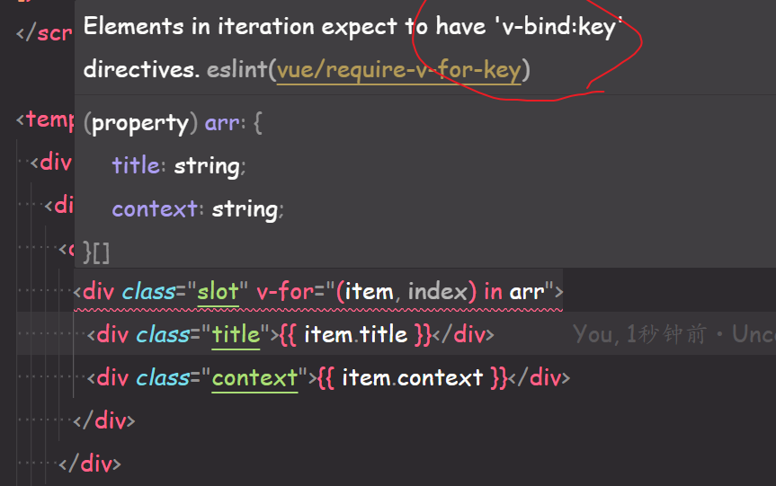
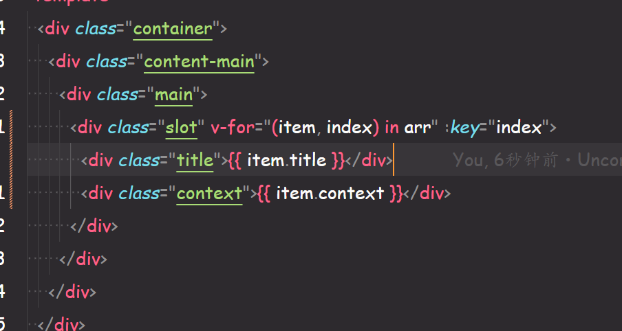
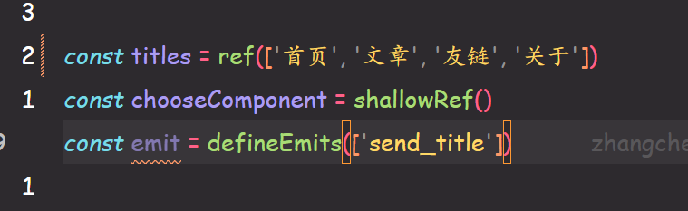
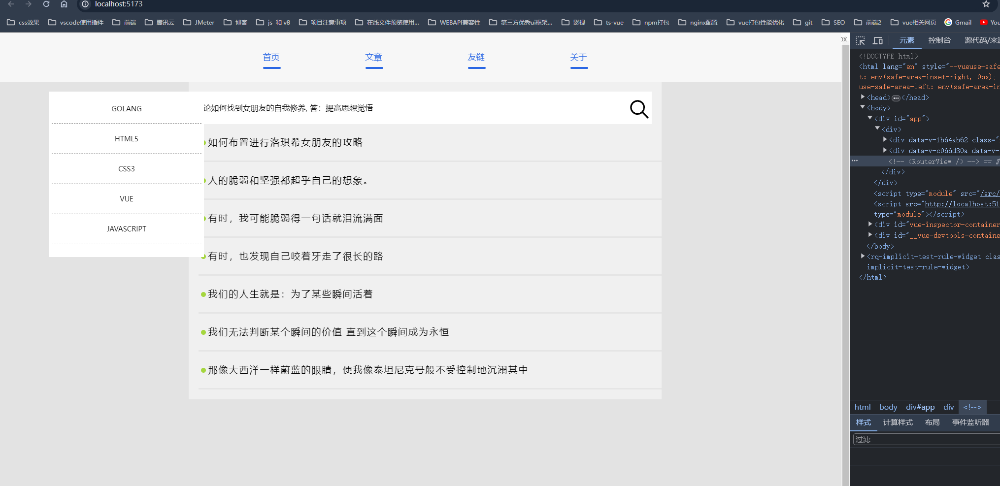
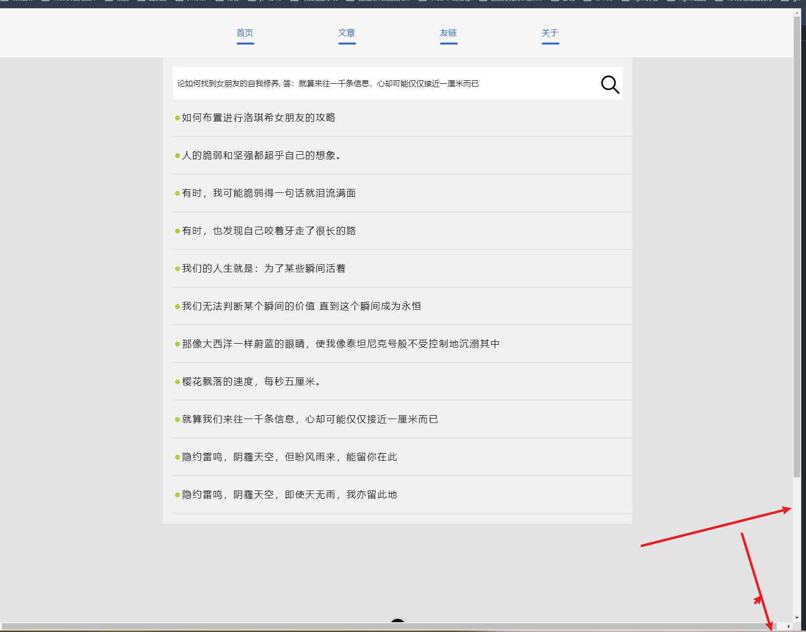

1. 有个很重要的问题
   
   这是我们的导入语句，但是在我这里报错，报什么错纳？
   
   可以看出来有关 vue 模板和 ts 类型的问题
   
   你这里没有加 lang=“ts”
   因为这个原因，ts 识别不出来这个是什么类型，所以报错
   **请检查你的所有页面，请修改这个地方**

2. 你的代码好像都没有格式化，请保持格式化的习惯，如果你没有格式化的习惯，请配置保存的时候自动格式化，对你会比较有作用

3. 
   v-for 循环一定要加 key！
   理论上 vue 的插件会检测出这个问题，不知道你发现没有
   如果不知道为什么 v-for 循环要加 key，你看一下官网对于这里的描述
   我帮你找到了具体的页面
   https://cn.vuejs.org/guide/essentials/list.html

4. 
   之前跟你说的 div 之间元素之间的空行记得，检查下所有的页面

5. 
   记得这三个变量你定义的顺序
   emit 应该在最上面
   你想想为什么？
   我们一个组件一个 vue 页面，他是不是可能有 prop，emit 传递事件，然后是自己的变量，方法，自己的生命周期
   你想想他从上到下的书写顺序是不是就是这样的？

6. 你现在切换组件用的 component，记得换成 routerview
   你可以先在这个项目里面写写 router 官方的简单案例，写一个你就会了
   实在不明白，call 我，演示给你

7. 
   当我打开 f12 时，左边的样式就会乱掉

8. 
   这个页面出现了多余的滚动条
   样式有问题
